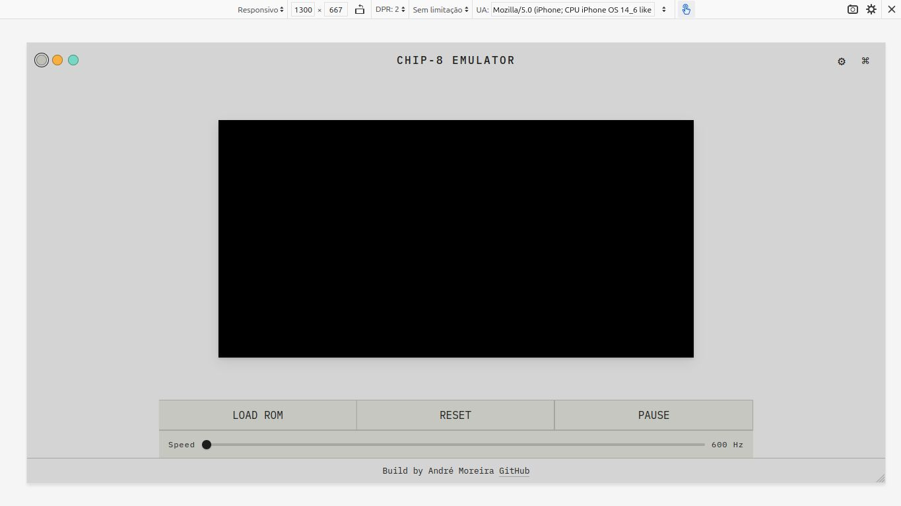
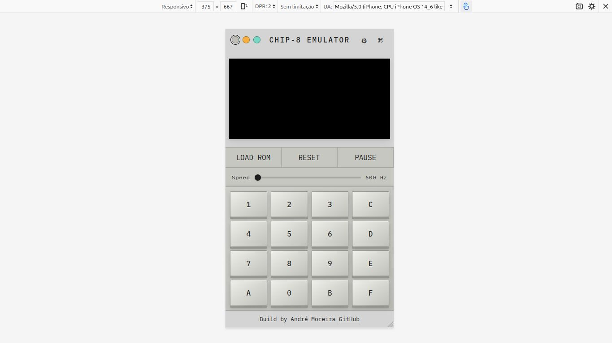

# Chip8Js

A simple CHIP-8 emulator that runs directly in the browser.

Features:
- Configurable CHIP-8 quirks
- Adjustable emulation speed and reset control
- Customizable UI colors with two selectable themes

## License

MIT License
